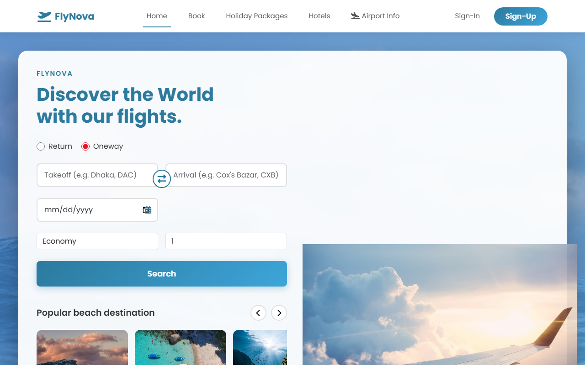
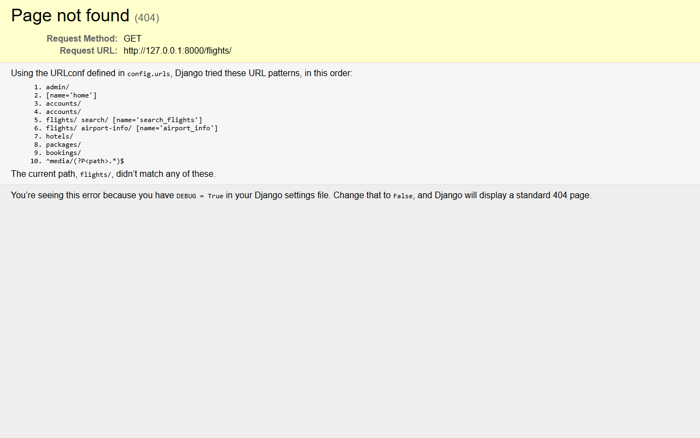
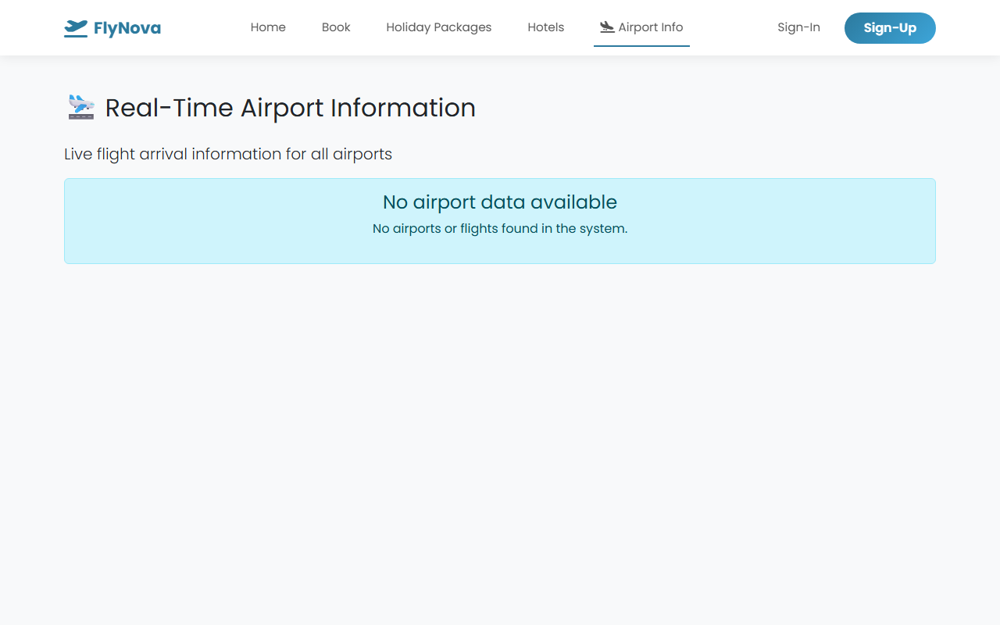
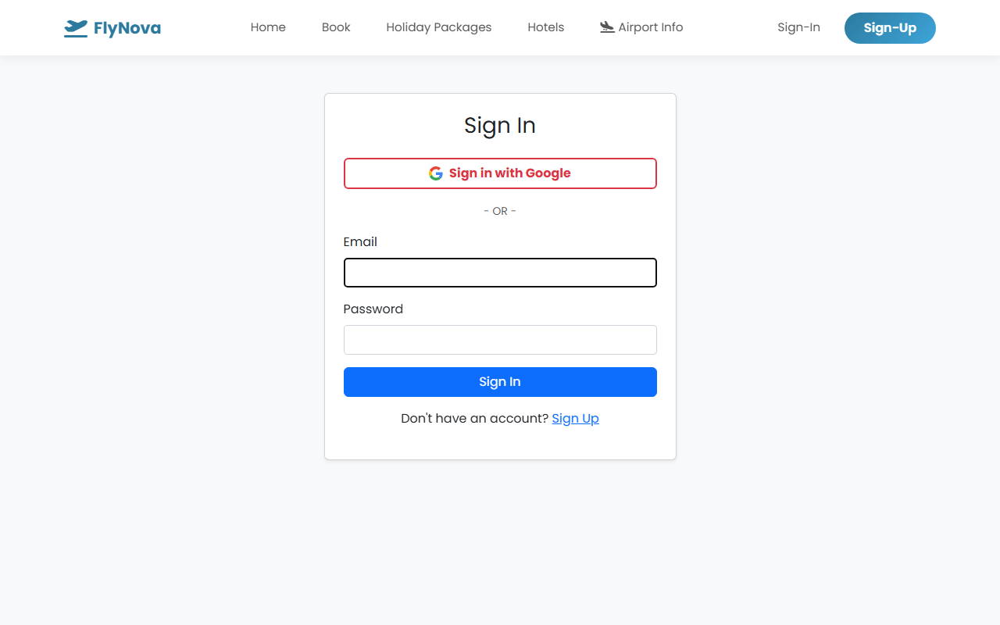
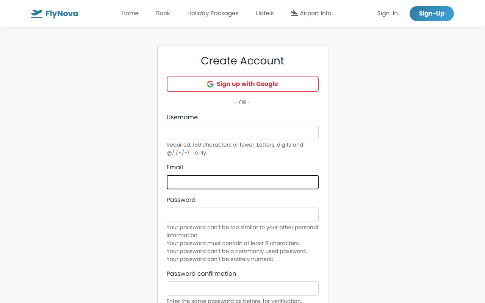

# Project Report: FlyNova

## 1. Project Information

**Project Name**: FlyNova  
**Developers**:
- Md Shariful Islam Rony
- Nabid Ahmad

**Live Demo**: [https://mdsharifulislamrony790.pythonanywhere.com/](https://mdsharifulislamrony790.pythonanywhere.com/)

---

## 2. Project Details

### Project Description
FlyNova is a comprehensive web-based platform designed to simplify the travel experience. It serves as a one-stop solution for booking flights, hotels, and holiday packages. The system bridges the gap between travelers and service providers by offering a seamless, user-friendly interface for searching, comparing, and booking travel services. With a robust backend and a modern frontend, FlyNova ensures reliability and ease of use for both customers and administrators.

### Project Objectives
-   **Centralized Booking**: To provide a single platform for flight, hotel, and holiday package bookings.
-   **User Convenience**: To enable users to easily search, filter, and book travel options with real-time availability.
-   **Efficiency**: To streamline the booking process with instant confirmation and PDF ticket generation.
-   **Accessibility**: To ensure the platform is accessible and responsive across various devices.
-   **Transparency**: To provide clear pricing, dynamic price categorization (Low/Mid/High), and real-time status updates.

### Technologies Used
-   **Backend Framework**: Django 5.2.8 (Python)
-   **Database**: SQLite (Development) / PostgreSQL (Production ready)
-   **Frontend**: HTML5, CSS3, Bootstrap 5, JavaScript
-   **Authentication**: django-allauth (includes Google OAuth)
-   **PDF Generation**: ReportLab
-   **Image Processing**: Pillow
-   **Version Control**: Git

---

## 3. Key Features

1.  **Multi-Service Booking Engine**:
    -   Integrated search and booking for Flights, Hotels, and Holiday Packages.
    -   Unified booking management system handling multiple content types.

2.  **Advanced Flight Search & Filtering**:
    -   Search by Origin, Destination, Date, and Passenger count.
    -   **Dynamic Price Categorization**: Automatically categorizes prices as "Low", "Mid", "High" based on statistical analysis of current listings.

3.  **Real-Time Airport Dashboard**:
    -   Displays live flight status (Scheduled, On Time, Landing Soon, Landed) for the next 24 hours.

4.  **Secure Authentication System**:
    -   User registration and login.
    -   **Google OAuth Integration**: One-click sign-in using Google accounts.

5.  **User Dashboard & Ticket Management**:
    -   Personalized dashboard for viewing booking history.
    -   **Instant PDF Tickets**: Users can download professional PDF tickets associated with their bookings.

6.  **Admin Management Panel**:
    -   Comprehensive tools for administrators to manage flights, airports, airlines, hotels, and packages.

---

## 4. User Experience (UX)

### Overall User Experience
FlyNova offers a clean, modern, and intuitive user interface. The design prioritizes ease of navigation, with clear calls-to-action and a structured layout. The use of Bootstrap ensures responsiveness, making the site usable on desktops, tablets, and mobile phones. Visual cues, such as color-coded price tags and status indicators, help users make informed decisions quickly.

### Ease of Use and Navigation
The navigation bar is consistent across all pages, providing quick access to Home, Flights, Hotels, Packages, and My Bookings. The flow from search to booking is linear and guided, minimizing user error. Forms are designed with validation to ensure correct data entry.

### Page-wise Description

#### Home Page

*The Home Page serves as the central hub, featuring a prominent search bar where users can toggle between Flights, Hotels, and Packages. It also displays featured destinations and current offers to inspire travelers.*

#### Flight Booking Page (Search Results)

*This page displays the available flights matching the user's search criteria. It lists essential details like Airline, Flight Number, Times, and Price. Users can filter results and click "Book Now" to proceed.*

#### Flight Page (Details & Airport Info)

*The Airport Information page provides real-time updates on flight arrivals and departures, helping users track flight status (e.g., On Time, Landed) directly from the platform.*

#### Hotel Page

*The Hotel page lists available accommodations in the selected city. Each listing shows the hotel name, star rating, price per night, and an image, allowing users to compare options easily.*

#### Payment Page (Checkout)
*The Checkout page is the final step before confirmation. It displays a summary of the booking, traveler details, and total price. Users can select their preferred payment method (Credit Card, bKash, Nagad) to complete the transaction.*

#### Google Authentication / Login Page

*The Login page offers a secure entry point for users. It features standard email/password login and a prominent "Sign in with Google" button for quick access without remembering new passwords.*

#### Registration Page

*The Registration page allows new users to create an account by providing their name, email, and password, ensuring they can manage their bookings efficiently.*
